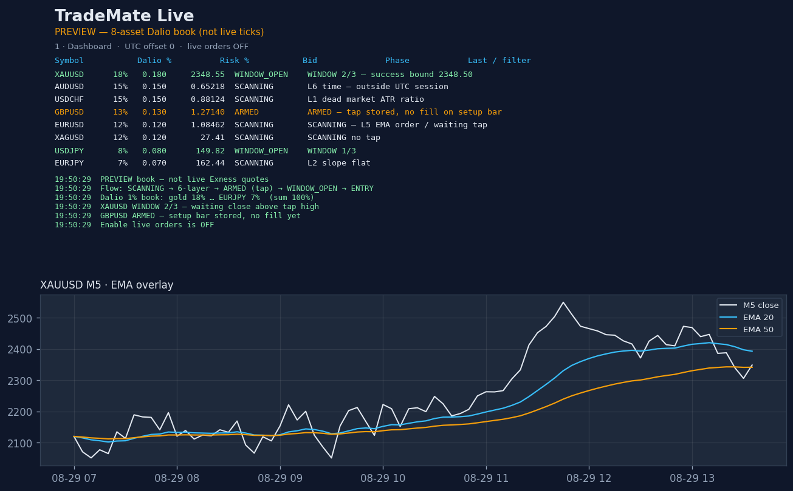
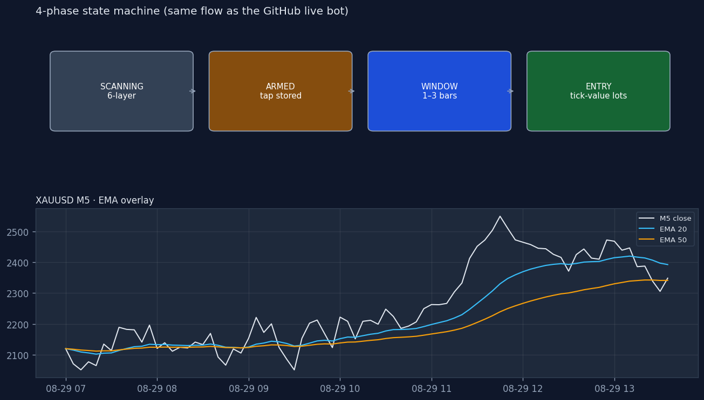
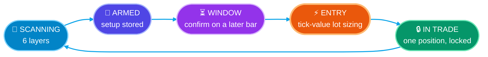
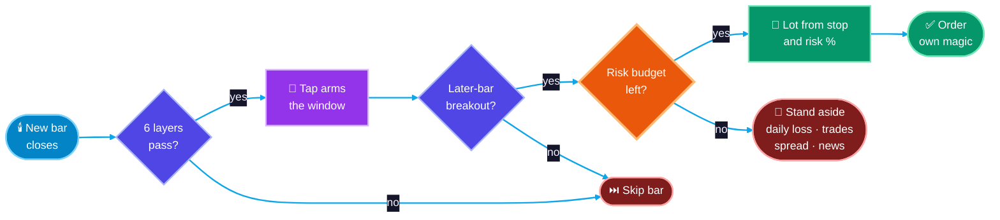

<picture>
  <source media="(prefers-color-scheme: light)" srcset="assets/theme/hero-light.svg"/>
  
</picture>

  A rule-based MetaTrader 5 Expert Advisor with a Python monitoring app, built around survivable risk rather than big promises. 
  Designed and built by <a href="https://github.com/flowser"><b>Eng. Felix Nyachio</b></a>.

  
  
  
  
  

> **This is a showcase repository.** The source code and tuned parameters are private. This page explains the engineering and risk design.
>
> **Not financial advice.** Backtests are not live results, and nothing here promises profit. Only trade money you can afford to lose.

## Screenshots

  
   Monitoring app: 8-asset book with per-symbol allocation, risk, phase and filter status (preview data)

  
   Entry state machine and trend overlay

## Design principles

1. **Survival before size.** A small, steady edge that survives a bad month beats a system that doubles and then dies.
2. **No martingale, no grid averaging, no "recover the loss" lot multipliers.** Ever. If that research is ever done, it lives in a separate, clearly labelled high-risk module.
3. **Risk is a first-class feature**, not a setting buried in the inputs.
4. **Code matches the written strategy.** Any logic change updates the strategy document in the same commit.
5. **Prove it before it goes live.** Out-of-sample holdout tests in the Strategy Tester, then demo, then live.

## How it trades

Every entry must pass **six independent filter layers** before a setup is even considered:

| Layer | Checks |
|---|---|
| L1 Volatility | Market is moving enough to trade (ATR-based) |
| L2 Trend angle | Higher-timeframe trend has a real slope |
| L3 Price location | Price is on the right side of the higher-timeframe trend |
| L4 Candle | The setup bar agrees with the trend |
| L5 Trend order | Moving averages are stacked in the trend direction |
| L6 Time and cost | Allowed session, no news pause, spread within limits |

Then a **state machine** controls timing, so the EA never fires on every tick:

### Every entry passes this gate

## Risk controls built into the EA

| Control | Default | Why |
|---|---|---|
| Risk per trade | **0.5%** of equity | Position size comes from stop distance and risk %, never from available leverage |
| Daily loss halt | **2%** | New entries stop for the day; no revenge trading |
| Max trades per day | **8** | Limits overtrading |
| Spread gate | Per symbol, separate gold limit, plus a spread-to-volatility ratio | Skips trades when costs eat the edge |
| News pause | **30 min** | Avoids high-impact releases |
| Minimum lot guard | On | If the correct size is below the broker minimum, the EA **skips** instead of oversizing |
| Portfolio cap | **1%** book risk | Across 8 assets if every setup fired at once |
| One magic number per version | On | Never touches positions it did not open |

## Architecture

| Component | Role |
|---|---|
| **Expert Advisor (MQL5)** | The only thing that places orders. New-bar logic, six-layer filters, state machine, risk engine. Modular includes rather than one giant file. |
| **Monitoring app (Python)** | 8-asset dashboard with allocation weights, phase per symbol, charts and logs. Live orders are off by default. |
| **Optional AI filter** | May only **block** weak setups via a local score file. It can never open trades, move stops or increase size. |
| **Research tooling** | Feature export, baseline comparison, and CI checks on every change. |

## Engineering practices

- Feature branches, CI checks, and a version ledger for every EA release
- Frozen strategy files — live bugs are fixed in code, never by retuning parameters to fit recent data
- Exact Strategy Tester settings recorded for every re-test
- Separate presets for EURUSD and XAUUSD (gold pip size is handled explicitly, not assumed)

## Contact

Need a trading system engineered with proper risk controls?

  
  
  

© 2026 Eng. Felix Nyachio. All rights reserved.
